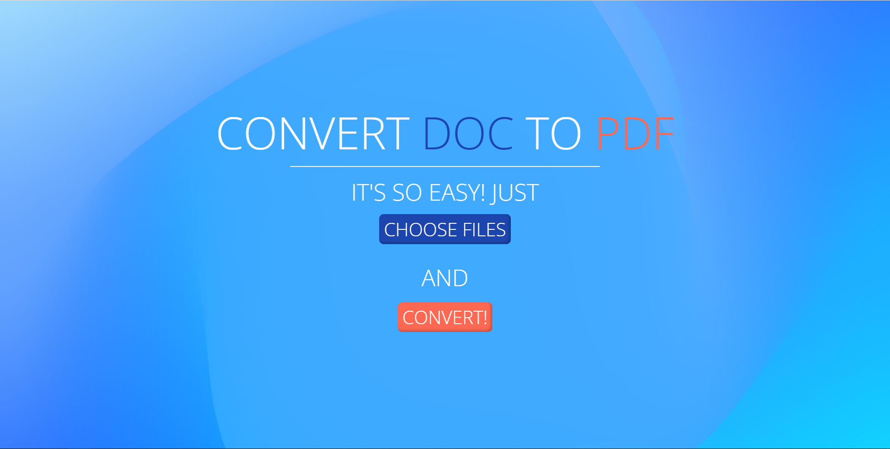

.. Doc To PDF 05 documentation master file, created by
   sphinx-quickstart on Fri Jun 17 15:18:21 2022.
   You can adapt this file completely to your liking, but it should at least
   contain the root `toctree` directive.

Welcome to Doc to PDF 05's documentation!
=========================================

==========
Doc To PDF
==========

This is the simple API to convert docs to PDF on Linux-like OS
or Windows OS. User sends their files to API it converts them, if it is needed and then
returns them in .pdf format.

.. toctree::
   :maxdepth: 2
   :caption: Contents:

   quickstart.rst
   api.rst
   models.rst
   serializers.rst
   algorithm.rst
   linux.rst
   windows.rst

Indices and tables
==================

* :ref:`genindex`
* :ref:`modindex`
* :ref:`search`
